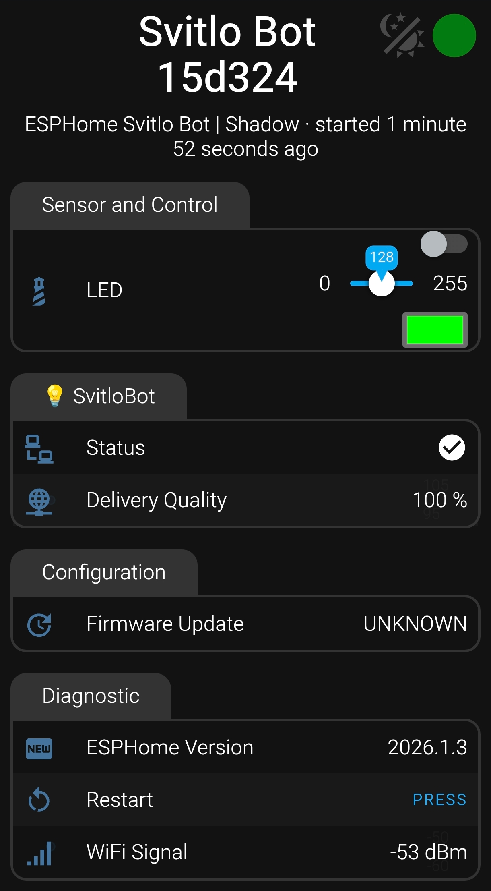
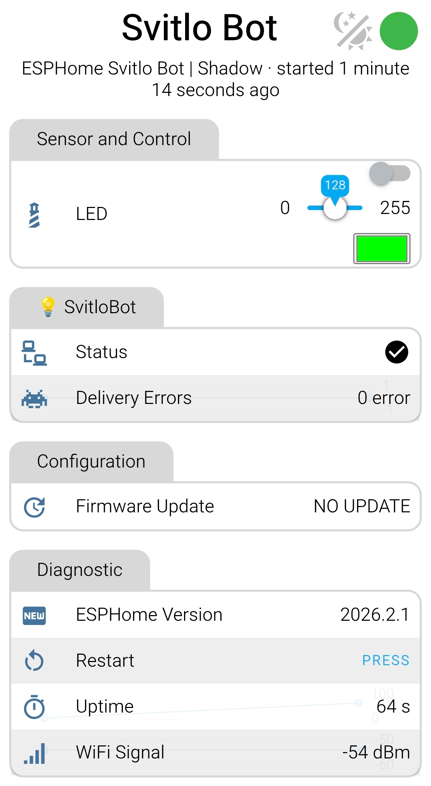

# ESPHome SvitloBot

## 💡 Ідея
Ідея **Svitlo**Bot полягає у створенні простого та зручного рішення для інтеграції з системою [**Світло**Бот](https://svitlobot.in.ua/), що дозволяє автоматично повідомляти про наявність світла.

!!! note "**Світло**Бот"
    [**Світло**Бот](https://svitlobot.in.ua/) - проект ентузіастів для моніторингу статусу світла у вашому будинку, який створила група учнів із ліцею [«Наукова&#160;Зміна»](https://naukova-zmina.org.ua/) - **Чигарьови Дмитро і Артем**. Суть проекту полягає в тому, аби підключивши вдома або в офісі бота на базі `ESP8266` або `ESP32` або підключивши в розетку на зарядку старенький або непотрібний смартфон/планшет (Android) та налаштувавши його згідно інструкції, ви зможете отримувати сповіщення у свій створений телеграм-канал повідомлення про наявність/відсутність світла на підставі того, йде зарядка цього смартфону чи ні.  Він допомагає тисячам українців оперативно дізнаватися про статус електромережі у себе вдома чи в офісі.

## ✨ Ключові можливості
*   **Миттєві сповіщення:** Прямі повідомлення у ваш телеграм-канал.
*   **Універсальність:** Підтримка будь-яких плат `ESP8266` та `ESP32`.
*   **Просте встановлення:** Прошивка в один клік через браузер.
*   **Гнучкість:** Можливість інтеграції з **Home Assistant** або робота як автономного пристрою.

## ⚙️ Як це працює

Принцип роботи **ESPHome SvitloBot** повністю повторює логіку оригінального проекту для [смартфонів](https://svitlobot.in.ua/#how_it_works), але реалізований на базі енергоефективного мікроконтролера.

### 🔌 Аналогія зі смартфоном

Працює це максимально просто:

1.  **Контролер як "сенсор":** Ви вмикаєте `ESP8266`/`ESP32` у розетку через звичайний блок живлення (як смартфон на зарядку).
2.  **Статус "Є світло":** Коли в мережі з'являється напруга, контролер вмикається, підключається до Wi-Fi та надсилає сигнал про те, що він "в мережі". Ви отримуєте повідомлення **"Світло є!"**.
3.  **Статус "Немає світла":** Як тільки живлення зникає, пристрій миттєво вимикається. Система фіксує припинення передачі сигналу та сповіщає про відсутність електрики. Ви отримуєте повідомлення **"Світло зникло"**

### 🔋 Переваги перед смартфоном

На відміну від старого телефона, використання ESP-контролера з цією прошивкою:

*   **Більш безпечно:** Немає акумулятора, який може здутися від постійної зарядки.
*   **Компактно:** Весь "пристрій" розміром із сірникову коробку.
*   **Надійно:** Контролер споживає мінімум енергії та розрахований на роботу 24/7 роками.

## 🛠 Варіанти прошивки

Виберіть конфігурацію, яка найкраще відповідає вашим потребам:

| Версія | Опис | Для кого | Функціонал |
| :--- | :--- | :--- | :--- |
| **SvitloBot** | Базова версія **(Рекомендовано)** | Для всіх користувачів | Сповіщення в телеграм-канал від системи [**Світло**Бот](https://svitlobot.in.ua/) при зміні стану живлення. |
| **HealthСheck** | Моніторинг зв'язку | Для досвідчених | "Сигнали життя" (pings) на [**Health**сhecks.io](https://healthchecks.io). Сповістить, якщо пристрій офлайн. |
| **Custom URL** | Індивідуальний моніторинг  | Для досвідчених | "Сигнали життя" (pings) на будь-який сервіс, URL вказується в налаштуваннях. |
| **All-in-One** | Комбінована прошивка | Для просунутих | **Svitlo**Bot + **Health**Сheck + **Custom**URL. Поєднує сповіщення в телеграм-канал від системи [**Світло**Бот](https://svitlobot.in.ua/) при зміні стану живлення та зовнішній моніторинг доступності. |

!!! tip "Яку версію обрати?"
    * **SvitloBot** (Базова) — рекомендована для більшості користувачів. Вона проста у налаштуванні та ідеально підходить для звичайного моніторингу світла.
    * **Healthcheck**, **Custom URL** або **All-in-One** — версії для просунутих користувачів, які розуміють принципи роботи зовнішнього моніторингу та потребують додаткового контролю доступності пристрою.

## 🚀 Швидкий старт

### Прошивка

Встановити прошивку можна двома способами:

1.  **Web Installer (Рекомендовано):** Скористайтеся [**SvitloBot - ESP Web Tools**](firmware.md). Це найпростіший шлях — просто підключіть `ESP` до `USB` та натисніть `Connect` у браузері.
2.  **ESPHome:** Використовуйте готові `.yaml` конфігурації з цього репозиторію для самостійної збірки.

!!! tip "ESP Web Tools"
    [Документація та приклади використання](https://esphome.github.io/esp-web-tools/)

### Отримайте ключ

Створіть бот у Telegram, скопіюйте з нього **"ключ для смартфона"** та вставте його у WEB-інтерфейс у поле **SvitloBot Key**.

!!! success "Готово!"
    Тепер ваш `ESP` працює і надсилає сповіщення про світло.

### Відео інструкція

## 🖼️ Скріншоти

Темна                        |  Світла
:---------------------------:|:-------------------------:
 |  

!!! info "Скріншоти"
    Приклад скріншотів для пристрою на базі [M5Stack Atom Lite](svitlobot_m5stack_atom_lite.md)
