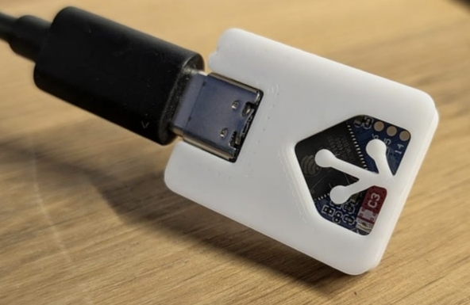

## M5Stack Atom Lite

{ align=left width=300 }

Індикація стану за допомогою вбудованого світлодіода.

- **Жовтий** - Немає підключення до WiFi або не введено ключ.
- **Червоний** - помилка при підключенні до сервісу.
- **Синій** - підключення до сервісу.
- **Зелений** - успішне підключення, через 3 секунди вимкнеться.
- **Вимкнено** - не було підключення, або все добре і ми в режимі очікування наступної сесії.

!!! example "Конфігурація"
    * [Файл конфігурації](https://github.com/andrewjswan/svitlobot/tree/main/devices/atom-svitlobot.yaml)

## ESP32 S3 Zero with RGB

{ align=left width=300 }

Індикація стану за допомогою вбудованого світлодіода.

- **Жовтий** - Немає підключення до WiFi або не введено ключ.
- **Червоний** - помилка при підключенні до сервісу.
- **Синій** - підключення до сервісу.
- **Зелений** - успішне підключення, через 3 секунди вимкнеться.
- **Вимкнено** - не було підключення, або все добре і ми в режимі очікування наступної сесії.

!!! example "Конфігурація"
    * [Файл конфігурації](https://github.com/andrewjswan/svitlobot/tree/main/devices/zero-svitlobot.yaml)

{ align=left width=300 }

!!! tip "Корпус"
    * [Посилання на проект корпусу](https://www.thingiverse.com/thing:7208746)
