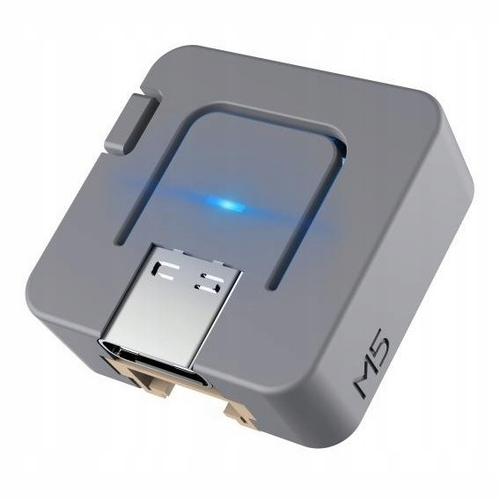

# M5Stack Atom Lite

{ align=left loading=lazy style="width:30%" }

Індикація стану за допомогою вбудованого світлодіода.

- **Жовтий** - Немає підключення до WiFi або не введено ключ.
- **Червоний** - помилка при підключенні до сервісу.
- **Синій** - підключення до сервісу.
- **Зелений** - успішне підключення, через 3 секунди вимкнеться.
- **Вимкнено** - не було підключення, або все добре і ми в режимі очікування наступної сесії.

!!! example "Конфігурація"
    * [Файл конфігурації](https://github.com/andrewjswan/svitlobot/tree/main/devices/atom-svitlobot.yaml)
    * [Прошивка](svitlobot-firmware.md)

!!! tip "Корисне"
    * [Документація](https://docs.m5stack.com/en/core/ATOM%20Lite)

