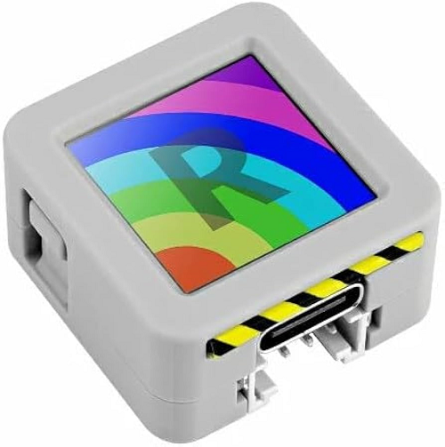

# M5Stack Atom S3R

{ align=left loading=lazy style="width:30%" }

Індикація стану за допомогою вбудованого дісплея.

!!! example "Конфігурація"
    * [Файл конфігурації](https://github.com/andrewjswan/svitlobot/tree/main/devices/atoms3r-svitlobot.yaml)
    * [Прошивка](svitlobot-firmware.md)

!!! tip "Корисне"
    * [Конфігурація від виробника](https://github.com/m5stack/esphome-yaml/blob/main/common/atoms3r-with-echo-base.yaml)
    * [Документація](https://docs.m5stack.com/en/core/AtomS3R)

